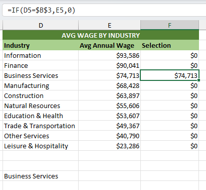

# Excel Dashboard – Interactive Labor Market Analysis
This project explores how interactive dashboards can be built in Excel using formulas, data validation, and form controls to simulate BI-style reporting.

## Objective

To design an interactive dashboard allowing users to explore wage and employment trends across industries and states, while evaluating the limitations of Excel for scalable dashboarding.

## Dashboard Overview
* Interactive dashboard analyzing U.S. labor statistics (2022–2025) by industry and state
* User-driven selection of industry using form controls and data validation
* Toggle between metrics (average wages vs employees per 1,000)
* Multiple coordinated visuals including bar charts, trend analysis, and geographic mapping

## Key Features & Techniques
* Built conditional calculations using AVERAGEIFS to dynamically update metrics based on user selections
* Implemented data validation and form controls (dropdowns and scroll inputs) to drive interactivity
* Created dynamic series highlighting in charts based on user input
* Structured data to support repeatable and flexible reporting views
* Simulated dashboard-style filtering and metric switching within Excel

## Example Logic (Dynamic Highlighting & Interactivity)

## Key Takeaways
* Excel can replicate elements of interactive dashboards, but requires complex logic and manual setup
* Interactivity (filtering, highlighting, metric switching) is significantly less scalable than in BI tools
* Reinforced the value of Tableau and Power BI for more efficient, maintainable, and user-friendly reporting

## Why This Project
This project was built to better understand how spreadsheet-based reporting compares to modern BI tools, and to explore how far Excel can be pushed to support interactive analytics.

## Files
[Excel Interactive Dashboard](Labor-Stats-Interactive-Dashboard.xlsx) - Full interactive dashboard
